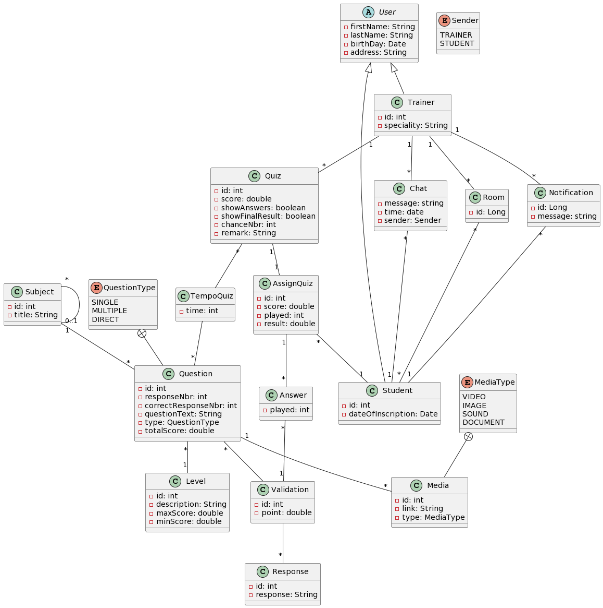

# YouQuiz
## Project class digram 

## Api documentation
### Level
endpoint| method | payload | description
-|--------|-|-
/api/level| `POST` |`{description:string, maxScore: int, minScore: int}`| create a level
/api/level/{id}| `GET`  | `-` | find level by id
/api/level/{id}| `PUT`  | `{description:string, maxScore: int, minScore: int}` | edit a level
/api/level/{id}/questions | `GET` | `-` | get questions of a specific level
/api/level| `GET` | `-` | get all levels

### Subject
endpoint| method | payload                          | description
-|--------|----------------------------------|-
/api/level| `POST` | `{title:string, parend_id: int}` | create a subject
/api/subject/{id}| `GET`  | `-`                              | find subject by id
/api/subject/{id}| `PUT`  | `{title:string, parent_id: int}` | edit a subject
/api/subject/{id}/questions | `GET` | `-`                              | get questions of a specific subject
/api/level| `GET` | `-`                              | get all subjects

### Question
endpoint| method | payload                                                                                                                                                                        | description                         
-|-------|--------------------------------------------------------------------------------------------------------------------------------------------------------------------------------|-------------------------------------
/api/question| `POST` | `{responseNbr:int, correctResponseNbr: int, questionText: string, type: string, totalScore: double, subject_id: int, level_id: int, medias: Array{name:string, type: string}}` | create a question                   
/api/question/{id}| `GET` | `-`                                                                                                                                                                            | find question by id                 
/api/question/{id}| `PUT` | `{responseNbr:int, correctResponseNbr: int, questionText: string, type: string, totalScore: double, subject_id: int, level_id: int, medias: Array{name:string, type: string}}`| edit question                      
/api/question/{id}/medias | `GET` | `-`                                                                                                                                                                            | get medias of a specific media 
/api/question| `GET` | `-`                                                                                                                                                                            | get all questions
/api/question/{id}/responses| `GET` | `-`| find response of question
/api/question/{id} | `DELETE` | `-` | delete question by id